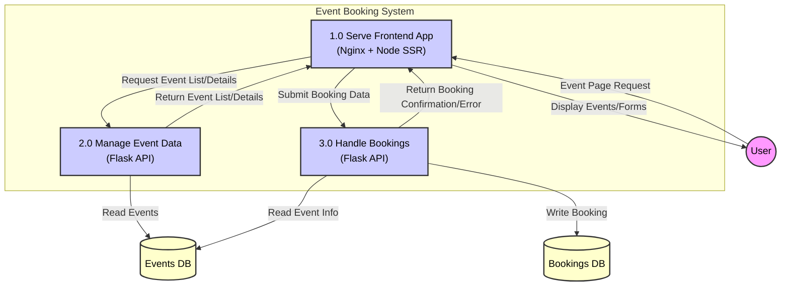

# Fraudproof Event Booking Application

A web application for browsing upcoming events and booking tickets. Built with an Angular frontend (utilizing Server-Side Rendering - SSR) and a Python Flask backend, using SQLite for simple data storage.

## Features

* View a list of available events fetched from the backend API.
* See detailed information for each event.
* Book 1 to 4 tickets for an event.
* Enter Name and Date of Birth for each ticket being booked.
* Booking details are stored in the backend database.

## Technologies Used

* **Frontend:** Angular (~17/18+), TypeScript, HTML, CSS
* **Backend:** Python 3, Flask
* **Database:** SQLite 3
* **API Communication:** RESTful API, CORS (for local development)
* **Node.js/npm:** For Angular development and building
* **Python Virtual Environment (`venv`):** For backend dependency management
* **(Deployment):** Gunicorn (WSGI Server), Nginx (Reverse Proxy), Systemd (Process Management), Angular SSR Node Server, Linux (GCP)
